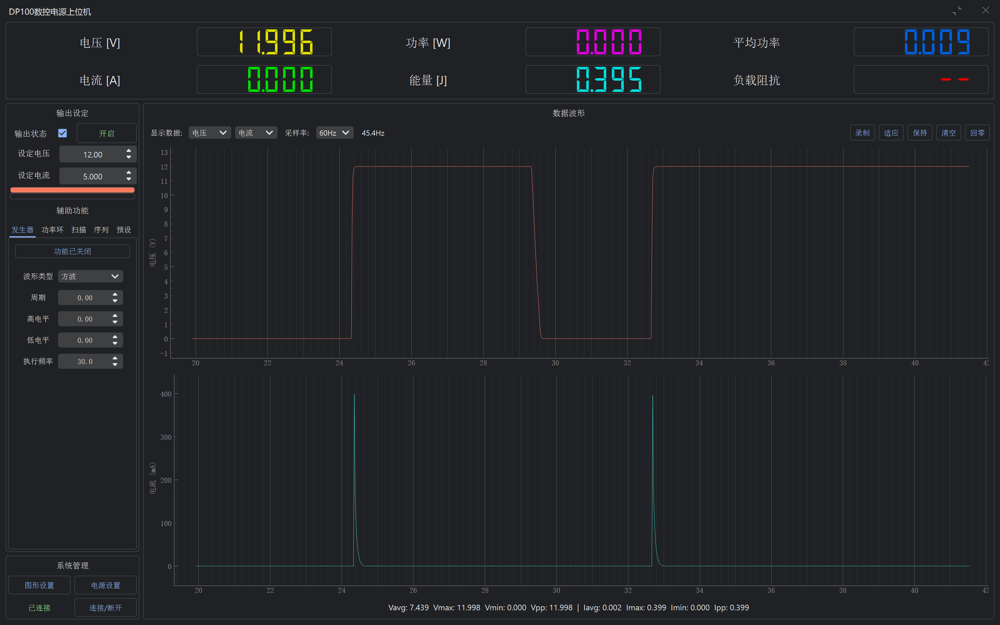

# 基于PyQt5的正点原子DP100数控电源上位机

 **这个上位机纯粹是基于我的个人需要和审美修改的, 如果你不喜欢请忽略它**

## 修改内容

 - 把图标改了回去
 - 更改了启动界面
 - 6个参数的数字改成了彩色
 - 默认开启OpenGL绘图
 - 默认分辨率为60Hz而不是50Hz

> 都是基于一些我感觉不爽内容做的修改所以改的很少就当~~水个仓库~~吧qwp~

## 功能

- 基本参数设定、预设组管理、设置修改
- 高达100Hz（可调）的数据采集、绘图、分析、保存
- PID恒功率控制
- 参数扫描（电压/电流）
- 函数发生器（正弦/方波/三角波/锯齿波/随机波）
- 操作序列（顺序执行操作）
- Material Design 风格

## 打包

使用了修改后的`QFramelessWindow`包，在`lib`文件夹中

release提供了打包好的exe文件，无需安装python环境

提供了快速运行`run.cmd`和打包`build.cmd`的批处理文件，虽然可能没用

`requirements.txt`文件没有整理，可能会有多余的包但没啥影响

> 界面字体用了更纱黑体且没做fallback，记得去[微软商店](https://www.microsoft.com/store/productId/9MW0M424NCZ7?ocid=pdpshare)装一个

## 关于二进制文件大小

Pyinstaller打包Qt程序时会自动添加不必要的Qt Plugins，导致二进制文件过大，认真修改spec文件排除不需要的dll和库可以减小到差不多30MB，但是我懒得改了，就这样

## 截图

